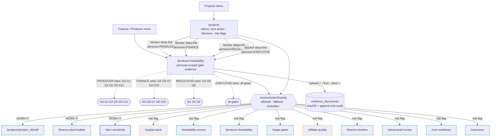

# GEX Causal-Ways Map — GENERATED (do not hand-edit)

> Source of truth: `App.tsx` (routes+guards) · `data/evidenceCatalog.ts`
> (evidence ways + finance-guarded set) · `features/projects/ProjectsPage.tsx`
> (risk / next-action helpers) · engine `bankability_engine.py` (PERSONA_GATES).
> Regenerate: `node frontend/scripts/audit-causal-ways.mjs` · generated 2026-06-15.
>
> **Doctrine (Hidalgo/Sung):** every claim traces claim → consequence → a *way*
> to the screen where it is worked, and a way only targets a screen the viewer
> can enter. **Blue** = routed through `resolveActionRoute()` (the way is
> decided centrally, not by the screen). **Red** = finance-guarded, hit raw
> (not yet migrated). **Amber-dashed** = workflow GateLock. **Green** = open.
>
> Migration is strangler-pattern: each call-site delegates to the resolver one
> at a time; a red edge turning blue is the proof a migration landed.

## Lint result (0 blocking)

- ✅ resolver-handled  evidenceCatalog → /dscr-sensitivity  (resolveActionRoute → allowed | fallback | forbidden)
- ✅ resolver-handled  roleNextAction → /capital-stack  (owner-surface; resolver routes non-owners to fallback)
- ✅ resolver-handled  roleNextAction → /offtake-quality  (owner-surface; resolver routes non-owners to fallback)
- ✅ resolver-handled  riskFlagAction → /offtake-quality  (owner-surface; resolver routes non-owners to fallback)
- ✅ resolver-handled  riskFlagAction → /capital-stack  (owner-surface; resolver routes non-owners to fallback)
- ✅ resolver-handled  riskAlertAction → /offtake-quality  (owner-surface; resolver routes non-owners to fallback)
- ✅ resolver-handled  riskAlertAction → /capital-stack  (owner-surface; resolver routes non-owners to fallback)

## Persona deep-link funnel (engine PERSONA_GATES)

A blocker deep-link to `/producer-bankability?gate=Gx` resolves only if Gx is in
the viewer's persona view — otherwise the screen shows an explicit "not in your
persona" notice (no silent miss).

- **PRODUCER** → G0_SITE_RIGHTS, G1_GRID_WATER, G3_FEEDSTOCK_LOGISTICS, G5_EPC, G9_PERMITS, G11_COD
- **FINANCE** → G4_OFFTAKE, G6_IE_SIGNOFF, G7_INSURANCE, G8_MODEL_AUDIT, G10_FINANCIAL_CLOSE
- **REGULATOR** → G2_CERTIFICATION, G6_IE_SIGNOFF, G9_PERMITS
- **EXECUTIVE** → all gates
