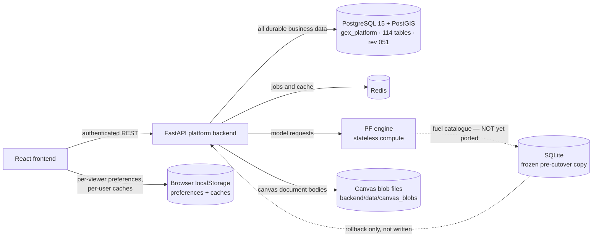

# GEX Database Architecture and Data Provenance

**Review date:** 2026-09-23
**Scope:** `gex-platform-enhanced` and `gex_pf_engine`
**Basis:** measured against the running PostgreSQL database, the SQLite file, the
source and the Alembic migrations on the date above. Where a number appears here
it was measured, not remembered. Re-measure before trusting one; this tree has
more than one session writing to it.

> **This document replaced an assessment dated 2026-09-22** whose conclusion —
> "all GEX data points are stored in PostgreSQL" is *not true for the current
> repository* — was correct when written and is now wrong. What changed, and
> what is still open, is in **What changed on 2026-09-22/23** at the end.

## Executive conclusion

PostgreSQL is the system of record, and the application reads and writes it.

- All **ten** `*_DB_BACKEND` switches are `postgres`. There is no longer a slice
  that silently answers from SQLite.
- **114 tables**, Alembic revision **051**, **107** under `FORCE ROW LEVEL
  SECURITY`.
- The runtime connects as `gex_app`, which is not a superuser, cannot bypass
  RLS, and holds no CREATE on schema `public`. Migrations use a separate
  credential.
- SQLite (`backend/gex_platform.db`, 117 tables, 11,259 rows) is a **frozen
  pre-cutover copy**, kept for rollback. Nothing writes it.
- Supabase is not an active persistence layer.

What is **not** yet true, stated plainly because this document exists to be
believed:

- Some UI values are still mock, demo or browser-local — the inventory is in
  **Data that is not database-backed**.
- 532 demo and test rows are still in PostgreSQL awaiting a purge that needs a
  human to run it.
- The PF engine still reads the frozen SQLite file for its fuel catalogue.

## System view



## Physical stores

| Store | Role | Assessment |
|---|---|---|
| PostgreSQL / PostGIS | System of record for every domain | Active and authoritative |
| SQLite `backend/gex_platform.db` | Frozen pre-cutover copy | Read by the PF engine only; otherwise rollback material |
| `backend/data/canvas_blobs/` | Canvas and library document BODIES on disk; PostgreSQL holds the pointer, digest and size | Active. **Not covered by the database backup** — see the warning below |
| Browser `localStorage` | Per-viewer preferences and per-user caches | Legitimate, with exceptions listed below |
| Redis | Celery broker/result backend and cache | Operational, not a system of record |
| Static code / JSON | Reference catalogues, seed rosters, UI fallbacks | Active for some displayed values — see provenance |

> **The canvas blob files are not in the database backup.** `VACUUM INTO` copies
> `gex_platform.db`; it does not copy `backend/data/canvas_blobs/`. A write to a
> `library` document REPLACES the previous file and unlinks it, and unlike
> `canvas` documents, `library` documents are not versioned — so an overwrite is
> irreversible. This is not theoretical: one 862-byte custom library was
> destroyed this way on 2026-09-23. Any backup procedure must copy that
> directory alongside the database.

## Credentials

```
DATABASE_URL          gex_app    runtime.  No SUPERUSER, no BYPASSRLS,
                                 no CREATE on schema public. RLS APPLIES.
ALEMBIC_DATABASE_URL  gex_user   DDL and migrations only.
```

Do not collapse these. DDL is not subject to RLS, so a migration running with
the runtime credential — or a runtime holding DDL rights — turns any injection
into a full read of every tenant.

**Verify RLS as `gex_app`, never as `gex_user`.** `gex_user` is SUPERUSER, and
PostgreSQL does not apply row-level security to a superuser — not even `FORCE
ROW LEVEL SECURITY`. A check run there reports every row visible to everyone,
which looks exactly like a broken policy and is in fact a broken measurement.

## Backend routing — all ten switches

| Switch | Domain | Value |
|---|---|---:|
| `AUTH_DB_BACKEND` | Authentication | postgres |
| `EVIDENCE_DB_BACKEND` | Evidence / bankability | postgres |
| `CAPITAL_DB_BACKEND` | Capital bridge, billing, open interest | postgres |
| `MARKET_DB_BACKEND` | Marketplace / trading | postgres |
| `ENTITLEMENT_DB_BACKEND` | Finance entitlements | postgres |
| `EVENTSTORE_DB_BACKEND` | Platform event ledger | postgres |
| `FUELREF_DB_BACKEND` | Fuel reference | postgres |
| `GOVERNANCE_DB_BACKEND` | Governance, staff directory, KYC/KYB | postgres |
| `DOMAIN_DB_BACKEND` | The 043/044 domain tail | postgres |
| `WORKSPACE_DB_BACKEND` | Canvas, plants, equipment equations | postgres |

`DOMAIN` and `WORKSPACE` are new. Before them, **15 modules opened SQLite
directly on a path captured at import and consulted no switch at all**, so the
cutover moved their data while their writes kept going to SQLite — 30 tables
were a snapshot pretending to be a migration, and `mass_balance_lots` had
already diverged. Those modules now use the shim.

A guardrail enforces this:
`test_no_module_opens_sqlite_without_consulting_a_backend_switch` matches the
AST, scopes itself to tables the migrations create, and runs with the database
stopped.

## Row-level security — the three shapes

| Shape | Policy | Tables |
|---|---|---|
| Tenant-scoped | `ADMIN OR company owns / has access to project` | the large majority |
| Reference | `USING (true)`, admin writes | `fuel_catalog`, `approval_policies`, `commercial_terms`, … |
| **Owner-scoped** | `owner_user_id = current_setting('app.current_user_id')` | `canvas_blobs`, `user_plants`, `equipment_equations` |

The owner shape is new and rests on `app.current_user_id`, bound on **both**
database paths (`PostgresConnection` and `db/session.py`) from one derivation in
`request_tenant.py`. `bind_from_request` returns both tokens and
`reset_identity` unbinds them together.

**`is_platform_admin` is not an owner-axis escalation.** It widens the tenant to
`PLATFORM_ADMIN`; it does nothing to the owner axis. Migration 050's policies
contain **no admin clause at all** — staff cannot read another user's canvas
through normal operation. That is deliberate and must not be "tidied up" to
match the neighbouring policies.

Support, deletion requests and offboarding go through
`app/core/break_glass.py`: one named subject, a purpose from
{SUPPORT, DELETION_REQUEST, OFFBOARDING}, a mandatory reason, and an `admin_log`
row **committed before the connection opens** — a log written afterwards records
only successful accesses.

KYC is the deliberate opposite: `kyc_profiles` admits the subject **or**
PLATFORM_ADMIN, because vetting is what KYC is for. A colleague still cannot
read it; the KYB record is company-scoped because it describes the legal entity.

## Provenance

Seeding a pre-production platform with plausible values is legitimate and
useful. Values will arrive first as hand-made seeds, then as real-world priors
from OSINT, open-source publications and the geomap, and finally from the
paying client, who owns and corrects them.

What is not legitimate is a seeded value that claims to have been verified.

```
SEED             a plausible value, made up to exercise the platform
EXTERNAL_PRIOR   OSINT, an open-source publication, the geomap database
CLIENT_ASSERTED  the client typed it
VERIFIED         GEX checked it against a document — with who, and when
```

`kyc_profiles` and `kyb_records` carry `provenance`, `source_ref`,
`verified_by` and `verified_at`, with CHECK constraints on the vocabulary AND on
the rule that `verified_by`/`verified_at` are NULL unless the row is VERIFIED —
so a seeded row structurally cannot wear a verifier's name. `verify()` is the
only path to VERIFIED, refuses self-verification, and any edit drops an existing
verification: a record that changed after it was checked has not been checked.

The CISO workspace serves invented rosters, barriers and an access-event feed.
Every fabricated response is stamped `provenance: "SEED"` **where the data is
served**, not in the literals, so a record added later inherits the stamp.
`/policy-matrix` is deliberately unstamped — it is configuration, not a claim
about a client, and a marker that appears everywhere teaches readers to ignore
it.

## Data that is not database-backed

| Category | Where | Status |
|---|---|---|
| Per-viewer preferences | colour presets, carrier overrides, toolbar and label prefs, Gantt visibility, session token | **Legitimate.** Disposable, per-browser |
| Per-user caches | `plantStore` (`ptool_plant_list`), `customLibrary` (`gex:customLibrary:<userId>`) | **Legitimate**, but see the note below |
| Durable business data still in the browser | `OwnershipRolesPanel` (team + component ownership, seeds a team into storage), `TeamAlignmentPanel`, `gex_user_role` | **Open.** Must move |
| Mock/fallback UI datasets | ~18 files defining `MOCK_`/`DEMO_`/`FALLBACK_` constants, incl. `LineagePanel`, `DFIDashboard`, `ICPackBuilder` (project-ID-derived pseudo-random data) | **Open.** Must become empty/error states |
| Fake identity | `contexts/AuthContext.tsx` returns a hardcoded `demo-user` to the canvas screens | **Open** |

**Caches must be namespaced per user.** `customLibrary` used the bare keys
`customEquipment` / `customCarriers` / `customGates`, with no owner in them. On a
shared browser that was a cross-account leak with an upload path attached: A's
library sat in those keys, B signed in, B's server library was empty, and the
code took "nothing stored" as its cue to push A's equipment into B's account
over B's token. Fixed 2026-09-23 by keying the cache on the signed-in user id.

`plantStore` still falls back to the hard-coded `projectRegistry` when its cache
is empty, so an empty portfolio renders as fabricated projects. Open.

## PF engine

`gex_pf_engine` owns no business schema; bankability and finance calculations
consume request payloads and return computed results.

Pricing is the exception and is **not yet ported**: it resolves the platform
SQLite file via `GEX_PLATFORM_DB_PATH` and reads `fuel_catalog` from it, falling
back to JSON reference data. Since SQLite is now frozen, that catalogue is a
snapshot; it matches PostgreSQL today and will drift the moment the catalogue is
edited. Source: `../gex_pf_engine/backend/pf_engine/api/routes_pricing.py`.

## Supabase

Not an active persistence layer. `frontend/src/integrations/supabase/types.ts`
is a stub, the client is gone, and the build runs `scripts/audit-supabase.mjs`
to stop it returning. The `demo-user` stub in `AuthContext.tsx` is what it left
behind.

Whether the external Supabase project still holds data cannot be established
from this repository; code removal does not delete remote tables or revoke keys.

## Known demo and test rows still in PostgreSQL

Measured 2026-09-23, awaiting `backend/scripts/purge_demo_data.py --execute`:

| Table | Rows | What they are |
|---|---:|---|
| `entitlement_audit` | 380 | nine project ids that never existed (`proj_nope`, `proj_econ_test`, `ADV-*`) |
| `bankability_evidence` | 125 | `submitted_by='demo_seed'` — of 127 rows, only 2 are genuine |
| `evidence_events` | 12 | `actor='demo_seed'` |
| `evidence_ledger` | 9 | `ADV-*` adversarial fixtures |
| `bankability_snapshots` | 3 | risk classifications COMPUTED FROM the seeded evidence |
| `finance_entitlements` | 2 | test project ids |
| `gateway_registry` | 1 | `cert_fingerprint='sha256:demo_cert_fingerprint_change_in_production'` |

They were written by `POST /bankability/evidence/seed`, an endpoint that took
`project_id` as an unchecked query parameter and so seeded **real** projects.
That endpoint, its API client and its two UI buttons were removed on
2026-09-23; without that, purging would be undone by the next click.

`auth_users` is **not** in that list. 17 of 20 rows carry
`activated_by='SEED_GRANDFATHERED'`, which is a provenance marker on real people
who predate the vetting flow. Deleting them would delete the platform's users.

## What changed on 2026-09-22/23

The previous version of this document described a half-finished migration. This
is what closed it.

**The PostgreSQL volume was wiped** on the morning of 2026-09-22 (all Docker
volumes recreated; no `gex_app` role, no `alembic_version`, PostGIS tables
only). `tenants` and `projects` live ONLY in PostgreSQL — SQLite has no copy —
so the rebuild needed `restore_registry_projects.py` and
`migrate_projects_collision.py --source-suffix _retired_pg_collision_20260807`.
The same thing happened on 2026-09-08. **A backup procedure is still missing**,
and it must cover `backend/data/canvas_blobs/` as well as the database.

**The cutover itself:** `scripts/cutover_postgres.py --execute` copied 86 tables
with row-and-column parity, the evidence hash chain reproduced exactly. Its
`alembic upgrade heads` was corrected to `auth_slice@head` — `heads` also runs
the legacy 001→011 branch, which collides with 044 on `matrix_rooms`.

**New migrations:** 046 `model_base_case.result_status` · 047 directory slice
(5 PII tables, GEX-staff-only) · 048 client billing + open interest · 049
`project_currency` · 050 canvas/plants/equations, owner-only · 051 KYC/KYB with
provenance.

**Defects found and fixed while doing it**, each of which had been invisible:

- `_ensure_override_table()` ran `CREATE TABLE IF NOT EXISTS` on every
  permission-override read. Against PostgreSQL that raised
  `InsufficientPrivilege` — and it sits in the permission RESOLUTION path, so
  every permission check consulting overrides was failing.
- Five places defaulted a **missing** `kyc_status` claim to `VERIFIED`, so a
  token that said nothing about KYC satisfied `requires_kyc:VERIFIED`. All now
  `UNVERIFIED`; the demo-mode identity says `SEED`.
- The test suite was writing the development database. `isolated_store` swapped
  only the SQLite path, which stops being isolation the moment a switch says
  `postgres`; two test files "isolated" with `GEX_PLATFORM_DB_PATH`, a variable
  no store reads. The fixture now derives the switch list from `Settings`, so a
  new switch cannot be forgotten. A full run writes **zero** rows to either
  store.

**Still open**, in the order I would take them:

1. Run `purge_demo_data.py --execute` and `fix_seeded_kyc_status.py --execute`.
2. Delete `u_admin` / `boss@example.com` — a platform-admin account created by a
   test run on 2026-09-22.
3. A backup procedure covering the database **and** the canvas blob directory.
4. Move `OwnershipRolesPanel`, `TeamAlignmentPanel` and `gex_user_role` out of
   the browser.
5. Replace the ~18 mock/fallback UI datasets and the `demo-user` stub.
6. Port the PF engine's fuel-catalogue read off the frozen SQLite file.
7. Version `library` documents, or accept that an overwrite is irreversible.

## Source anchors

- Slice routing, identity binding, the shim: `backend/app/core/db_backend.py`,
  `backend/app/core/request_tenant.py`
- Schema: `backend/alembic/versions/`
- Owner-scoped policy and the break-glass path:
  `alembic/versions/050_workspace_owner_scoped.py`, `app/core/break_glass.py`
- Provenance: `alembic/versions/051_kyc_kyb_store.py`, `app/core/kyc_store.py`
- Cutover and cleanup scripts: `backend/scripts/cutover_postgres.py`,
  `migrate_workspace_slice.py`, `purge_demo_data.py`, `fix_seeded_kyc_status.py`
- Guardrails: `backend/tests/test_architecture_guardrails.py`,
  `test_workspace_owner_policy.py`, `test_break_glass.py`, `test_kyc_store.py`
- Frontend exception inventory: `docs/frontend-data-persistence-audit.md`
  (predates this work — read it against the table above)
