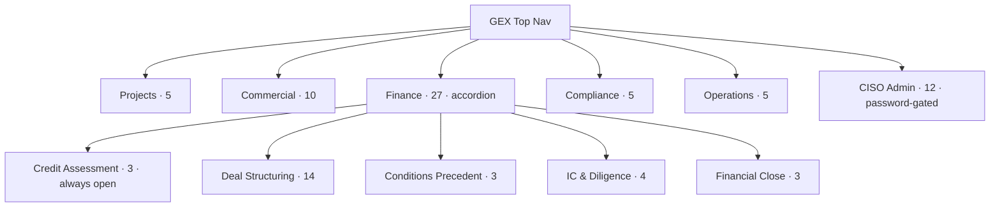
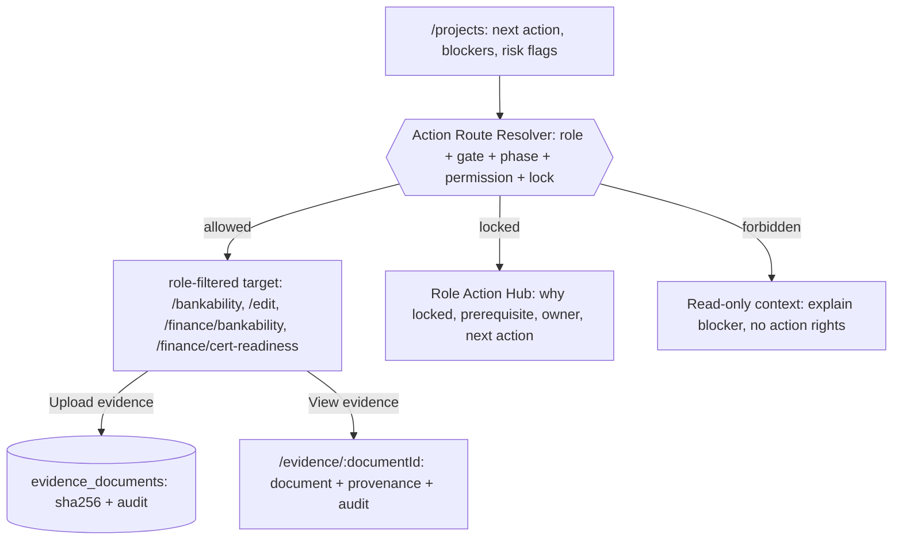

# GEX Menu Architecture — Source of Truth (post-consolidation v6.1)

> Source: `frontend/src/config/menuArchitecture.ts` · de-aliased 2026-05-30.
> Audit reproducer: `node frontend/scripts/audit-menu.mjs` (reads the real
> config, computes per-role visibility + duplicate-route check, **plus
> door↔screen coherence and CTRM completeness** — see §9).
> **Figma import:** ```mermaid``` blocks paste into FigJam (Insert → Diagram →
> Mermaid) or the *Mermaid Chart* plugin.

This document replaces the pre-consolidation map. The maze defects it described
(path aliasing, the `/reports` five-door stub, the "lineage" name clash, the
24-row Finance dropdown, badge noise) have been resolved — see §4.

---

## 1 · Doctrine (enforced)

- **One screen → one canonical name → one canonical menu home.** No route is
  exposed under two labels in the main tabs (verified, §3).
- **Merges preserve access by role-union.** Where two entries pointed at the
  same screen, the survivor's `visible_to` is the *union* of both audiences.
  Because both doors already led to the same room, the union grants **no new
  access** — it only removes a redundant door (proof in §5).
- **`/reports` is one honest hub.** Five former doors are in-page views with
  explicit `LIVE`/`PLANNED` state; the header count is derived, so it can never
  claim a live report that isn't.
- **Badges are gate-derived, never hard-coded.** `BLOCKED · Gx` (gate unmet) /
  `GATE READY` (gate met). No `IC READY` — gate access does not prove the IC
  pack is complete.
- **Finance renders as collapsible accordions** in lender language; the section
  containing the active route auto-opens.
- **Access ≠ navigation prominence (two-layer model).** A role may *access* a
  screen without it being *promoted* in the global top-nav. Consult-only
  (analytics/truth) screens are demoted from the nav of heavy personas and
  surfaced on the Project profile instead. See §8.
- **Pre-COD finance metrics are first-class GEX objects. DSCR sensitivity may be
  projected, modelled, or scenario-based before COD. It is restricted because it
  is sensitive, not because it is irrelevant before COD.** Entitlement to such
  metrics is by **role/function** (finance-function users + lenders/insurers),
  never a generic company-type rule.
- **Cross-surface aliases** (one screen, two menu surfaces) are allowed **only**
  where the user mental model is genuinely different AND the role boundary is
  hard — currently the single case `/ciso-gateways` (Operations monitoring vs
  CISO admin config). This is the exception, not a licence to reintroduce
  duplicate names in the main tabs.

---

## 2 · Current build — tabs & weight



> Finance carries the most items by design (it is the deepest workspace), but
> the accordion means a banker opens it to 3 core rows + 4 collapsible headers,
> not a 26-row wall. The active section auto-expands.

### Finance sections (lender language)
| Accordion group | Was (v6.0) | Items |
|---|---|---|
| Credit Assessment *(always open)* | *(ungrouped)* | Project Readiness, Capital Stack, Covenants |
| Deal Structuring | STRUCTURING | Sensitivity, Price Decomposition (Gabillon), Cost Basis, Gap Analysis, Instrument Catalog, Instrument Compatibility, Package Builder, Risk Allocation, Structuring Timeline, Spend Wave, **Debt Cashflow & Waterfall**, Drawdown Timeline, DFI Dashboard, Evidence Lineage |
| Conditions Precedent | GATING | Insurance Schedule, Coverage Lines, Asset & Exposure Register |
| IC & Diligence | EXPORT | Banker's Snapshot, IC Pack Builder, Transfer Readiness, Data Room |
| Financial Close | DEAL ROOM | Approval Queue, Commitment Signing, Commitment Verifier |

---

## 3 · Role → route visibility audit  *(computed by `audit-menu.mjs`)*

Counts are **distinct routes** visible in the main 5 tabs. Producer/Offtaker are
shown as the org-union across business functions; an individual user sees a
function-scoped subset. CISO Admin is a separate password-gated surface.

| Role | Routes visible | Notes |
|---|---:|---|
| **Producer** (org union) | 50 | broadest; an individual producer user sees only their function's slice |
| **Bank** `TP(BANK)` | 37 | full finance + structuring + IC + close |
| **Offtaker** (org union) | 25 | commercial + readiness + data room |
| **Insurer** `TP(INSURER)` | 17 | risk, coverage lines, asset register, data room |
| **Legal** `TP(LEGAL)` | 15 | contracts, regulatory registry, data room |
| **Certifier** `TP(CERTIFIER)` | 14 | cert readiness, verification, data room |
| **Engineer** `TP(ENGINEER)` | 14 | cost basis, plant telemetry, construction progress |
| **Logistics** `TP(LOGISTICS)` | 12 | GreenMesh/capacity + shared read-only screens |
| **CISO / Admin** | 12 | separate surface (security, residency, gateways, pricing admin) |

**Duplicate-route-per-role check:** ✅ PASS — no role sees the same route under
two different names. **Global route→label collisions:** ✅ PASS — every route has
exactly one label across all main tabs.

**Persona-minimum guarantee:** ✅ PASS — `audit-menu.mjs` encodes each role's
*signature tasks* (e.g. Engineer ⇒ Cost Basis + Construction Progress + Plant
Telemetry; Logistics ⇒ GreenMesh; Certifier ⇒ Cert Readiness + Verification).
The audit **exits non-zero** if any future `visible_to` change strips one — so
"a user always has its role-specific tasks" is a CI-enforceable invariant, not a
promise. (Verified: simulated removal of Engineer→Cost Basis fails the check and
returns exit 1.)

Shared read-only floor visible to essentially every role: `/projects`,
`/dashboard`, `/finance-dashboard` (Task Flow), `/bankability-scores`,
`/adversarial-review`, `/dscr-sensitivity`, `/pricing-lineage`,
`/evidence-hierarchy`, `/finance-timeline`, `/reports`, `/commitment-verifier`.

---

## 4 · What changed from v6.0 (maze → function)

| Defect (v6.0) | Resolution |
|---|---|
| `/reports` reached by **5** labels (false doors) | One **Reports & Evidence** hub (Compliance); the 5 are in-page views with `LIVE`/`PLANNED` state, deep-linkable `?view=` |
| 9 routes carried 2 labels each | Merged to one canonical name+home; roles unioned (§5) |
| "Price Lineage" vs "Information Lineage" clash | **Price Decomposition (Gabillon)** vs **Evidence Lineage** |
| Finance = 24-row scroll | Collapsible accordions, lender language, active section auto-opens |
| ~10 `is_new` badges (noise) | Removed; replaced by gate-derived `BLOCKED · Gx` / `GATE READY` |
| `/ciso-dashboard` ×2 (Overview + Event Bus) | Merged to Security Overview |

Net: **75 → 63** entries (main-nav 62 → 51; CISO 13 → 12), **zero destinations lost**.

---

## 5 · Overexposure review (role-union safety)

**Headline:** merging duplicate entries cannot overexpose a screen. For each
merge the survivor audience = `roles(A) ∪ roles(B)`, and **both A and B already
linked the same screen** — so every role in the union already had a door to that
room. The merge removes a redundant door; it never opens a new one.

Per merged route — survivor visibility and whether the breadth is intentional:

| Route | Survivor visibility | New access introduced? | Intentional |
|---|---|---|---|
| `/finance-plant-builder` (Cost Basis) | PROD(FIN/EXEC/ENG), TP(BANK/ENGINEER/EQUIPMENT) | none — exact union | ✅ engineers & equipment vendors build the CAPEX basis |
| `/plant-data` (Plant Telemetry) | PROD(OPS/ENG), TP(ENGINEER) | none | ✅ |
| `/producer-bankability` (Construction Progress) | PROD(ENG/OPS), TP(ENGINEER) | none | ✅ |
| `/capacity` (GreenMesh) | PROD(COM/OPS), OFT(OPS), TP(LOGISTICS) | none — exact union | ✅ offtaker-ops sees shipping capacity |
| `/cert-readiness` (Certification Readiness) | PROD(LEGAL/ENG), TP(CERTIFIER), OFT(LEGAL/COM) | none — exact union | ✅ |
| `/finance-timeline` (Project Timeline) | ALL | none — screen was already ALL via "Project Timeline" | ⚠ see risk R1 |
| `/bankability-scores` (Status & Blockers) | ALL | none — both entries ALL | ✅ |
| `/ciso-dashboard` (Security Overview) | CISO surface | none | ✅ |

**Verified:** each survivor's `visible_to` equals the exact union of the two
originals — no stray role was added (checked against the v6.0 definitions).

---

## 6 · Remaining risks

- **R1 — `/finance-timeline` is ALL-visible (pre-existing, not introduced).**
  The former "Milestones & Drawdown" (PROD-FIN / BANK) was folded into the
  ALL-visible "Project Timeline" — but the *screen* was already ALL before the
  merge. If milestone/drawdown content is finance-sensitive, the ALL visibility
  should be reviewed. **This work did not widen it.**
- **R2 — `/dscr-sensitivity` and `/pricing-lineage` are ALL-visible
  (pre-existing).** Sensitivity analysis and price decomposition are visible to
  every role incl. Logistics/Certifier. Defensible as transparency, but worth a
  conscious confirm. Not changed by this work.
- **R3 — `/ciso-gateways` cross-surface alias (intentional).** Reachable as
  "OT Gateway Status" (Operations, PROD-OPS) and "OT Gateways" (CISO admin).
  Two personas, two surfaces, one screen — kept deliberately (ops monitoring vs
  admin config). Not a same-role main-nav duplicate.
- **R4 — Reports hub views are all `PLANNED`.** Honest today; when a view ships,
  flip its cards to `LIVE` and the header count updates automatically.

---

## 7 · CISO Admin (password-gated, 12 items)
Security Overview · Access Monitor · Identity & Access (ABAC) · Information
Barriers · Data Residency · OT Gateways · Communications Monitor · Gantt
Visibility · Policy Matrix · Compliance (ISO 27001) · Pricing Curves (Gabillon)
· Forward Curves (Project view).
*(Event Bus Monitor merged into Security Overview.)*

---

## 8 · Two-layer model — operate vs consult (prototype: Finance & Bank)

`MenuItem.consult_for?: VisibilityRule[]` marks a screen as **consult-only**
(read, not operate) for the listed roles. Such roles keep full access
(`visible_to` unchanged) but the screen is dropped from their top-nav and
surfaced on the Project profile's **"Analytics & Truth"** section instead.

Three helpers separate the two axes:
- `isVisible` — **access** (may the role reach it at all?)
- `isConsultOnly` — read-not-operate for this role
- `isVisibleInNav = isVisible && !isConsultOnly` — **prominence** (top-nav)

**Prototype scope:** 9 analytics screens tagged `consult_for: [PROD(FINANCE_TREASURY), TP(BANK)]`
— Sensitivity, Price Decomposition, Cost Basis, Evidence Lineage, DFI Dashboard,
Instrument Catalog, Instrument Compatibility, Structuring Timeline, Spend Wave.
(Engineers still *operate* Cost Basis, so it stays in their nav — the split is
role-relative.)

**Measured (per-user, `audit-menu.mjs`):**

| Persona | Top-nav before | Top-nav after | Access (unchanged) |
|---|---:|---:|---:|
| Producer / Finance-Treasury | 39 | **30** | 39 |
| Bank | 37 | **28** | 37 |
| every other persona | — | unchanged | unchanged |

Access-preservation check: ✅ every consult-demoted screen remains reachable.
Further reduction below ~28–30 requires the **portfolio-vs-project** split
(project-scoped operate screens → Project profile) — see follow-up Ticket 3.

---

<!-- §9:AUTO:START -->
## 9 · Door↔screen coherence & CTRM completeness  *(GENERATED by `audit-menu.mjs` — do not hand-edit)*

> Regenerate: `npm run audit:menu`. Build runs `--check` and fails if this
> block is stale. §1–§8 verify **access**; §9 verifies **honesty** — does a
> door open the screen it names (Hidalgo), and is "Commercial" honest about
> which CTRM functions exist? Advisory (does not gate access), but it answers
> the buy-side / CTRM diligence question the access audit cannot.

### Commercial workspace (10 doors)

```mermaid
flowchart TD
  COM[Commercial · 10 doors]
  COM --> D0["Commercial Overview → /marketplace"]:::ok
  COM --> D1["Purchase → /offtaker-supply"]:::ok
  COM --> D2["Sales → /finance-demand"]:::ok
  COM --> D3["Offtake Quality → /offtake-quality"]:::ok
  COM --> D4["Matching Engine → /matching"]:::ok
  COM --> D5["RFQ Management → /trader-dashboard"]:::ok
  COM --> D6["Contracts → /contracts"]:::ok
  COM --> D7["Term Sheet Tracker → /term-sheet"]:::ok
  COM --> D8["Delivery & Settlement → /settlement"]:::ok
  COM --> D9["GreenMesh (Capacity & Logistics) → /capacity"]:::ok
  COM -.->|Optional (post-v1)| GP0[[Deal capture / blotter — ABSENT]]:::gap
  COM -.->|Not intended — integrate external CTRM| GP1[[Position book / net exposure — ABSENT]]:::gap
  COM -.->|Not intended — integrate external CTRM| GP2[[Mark-to-market / P&L — ABSENT]]:::gap
  COM -.->|Required for CTRM-lite v1| GP3[[Credit risk / exposure limits — ABSENT]]:::gap
  COM -.->|Not intended — integrate external CTRM| GP4[[Risk limits / VaR (commercial) — ABSENT]]:::gap
  COM -.->|Optional (post-v1)| GP5[[Trade confirmations — ABSENT]]:::gap
  classDef ok stroke:#10b981,stroke-width:1.5px;
  classDef warn stroke:#f59e0b,stroke-width:2px,stroke-dasharray:4 3;
  classDef gap stroke:#64748b,stroke-width:1.5px,stroke-dasharray:2 3,color:#64748b;
```

### Door↔screen coherence — 5 mismatch(es), 16 route-name drift

- ⚠ Projects · "Task Flow"  →  /finance-dashboard  (FinanceDashboardPage)
- ⚠ Projects · "Status & Blockers"  →  /bankability-scores  (BankabilityScorePage)
- ⚠ Compliance · "Verification Status"  →  /stage-gates  (StageGatesPage)
- ⚠ Compliance · "Regulatory Registry"  →  /regulator-dashboard  (RegulatorDashboardPage)
- ⚠ Operations · "Construction Progress"  →  /producer-bankability  (ProducerBankabilityView)

- **Fixed:** the "Counterparties" door previously opened a screen inconsistent
  with its label (the screen is *Delivery & Settlement*; no counterparty/credit
  module exists). Now corrected — the door is **Delivery & Settlement**, and
  counterparty/credit is tracked below as a CTRM gap rather than implied by a door.
- **Route-name drift (16):** URL ≠ label on legacy paths. Deferred —
  URL renames break deep links; do via a canonical-route alias registry (ticket).

### CTRM completeness — what GEX Commercial *is*

Present: **origination → matching → RFQ → contracts → term-sheet →
offtake-quality → settlement → capacity**. The risk-book half is **6/6 absent**.
Disposition reflects the posture *GEX is an offtake/bankability OS, not a
merchant trading desk* — edit `CTRM` in `audit-menu.mjs` to change it.

| CTRM function | Status | Disposition |
|---|---|---|
| Deal capture / blotter | ⛔ absent | Optional (post-v1) |
| Position book / net exposure | ⛔ absent | Not intended — integrate external CTRM |
| Mark-to-market / P&L | ⛔ absent | Not intended — integrate external CTRM |
| Credit risk / exposure limits | ⛔ absent | Required for CTRM-lite v1 |
| Risk limits / VaR (commercial) | ⛔ absent | Not intended — integrate external CTRM |
| Trade confirmations | ⛔ absent | Optional (post-v1) |

GEX Commercial is a credible **deal desk**; it is **not a CTRM** until the
`v1`-dispositioned functions exist. Trading-desk vocabulary (e.g. the former
"Trader Dashboard" with fabricated position/P&L tiles) was removed so the menu,
docs, and investor narrative state this precisely.
<!-- §9:AUTO:END -->

<!-- §10:AUTO:START -->
## 10 · Project-finance completeness  *(GENERATED by `audit-menu.mjs` — do not hand-edit)*

> The Finance analog of §9. Finance is GEX's strongest workspace by coherence
> (0 stubs, 0 door↔screen mismatches) but **under-harvested**: the engine
> computes debt mechanics the UI never surfaces. Status:
> **🟠 engine-only = value on the floor** (computed, not shown). A surfaced
> metric is lender-grade *only if it carries model-governance provenance*
> (SEED vs MARKET, `rules_version`, challenger) — a naked DSCR/LLCR tile is
> the Finance equivalent of the fabricated "P&L MTD" removed from Commercial.

```mermaid
flowchart TD
  ENG[("PF engine<br/>cfads · waterfall · sculpting · tranche")]
  FINUI[Finance UI]
  ENG -->|surfaced today| FINUI
  FINUI --> V1[DSCR Sensitivity]:::ok
  FINUI --> V2[Covenants]:::ok
  FINUI --> V3[Drawdown Timeline]:::ok
  ENG -.->|surface to UI| U0[[Cash sweep / lock-up]]:::eng
  ENG -.->|surface to UI| U1[[Debt sculpting / repayment profile]]:::eng
  ENG -.->|surface to UI| U2[[Sources & Uses statement (itemized)]]:::eng
  ENG -.->|surface to UI| U3[[Hedging (rate / FX / power)]]:::eng
  AB[[LLCR · PLCR · Sources&Uses — not computed]]:::gap
  classDef ok stroke:#10b981,stroke-width:1.5px;
  classDef eng stroke:#f59e0b,stroke-width:2px;
  classDef gap stroke:#64748b,stroke-width:1.5px,stroke-dasharray:2 3,color:#64748b;
```

**4 engine-only function(s)** = the highest-ROI fixes: the maths
already exists (`/cfads/calculate`, `/waterfall/execute` incl. DSRA + cash
sweep, `debt/sculpting.py`), it is simply not wired into a Finance screen.
**2 absent**: LLCR/PLCR are only consumed as lock-up *thresholds*,
never computed; Sources & Uses and refinancing have no primitive.

**Governance (provenance before completeness):** a ui-visible ratio is lender-grade
only if its screen carries an assumption stamp (basis · scenario · rules_version ·
reliance). 🔴 NAKED = surfaced without a stamp — currently **WARN** (advisory);
flip to a hard build gate once every surfaced ratio is stamped.
*Heuristic limit (honest):* "governed" here means surfaced on **≥1** stamped
screen (Debt Cashflow & Waterfall, Finance Bankability pre-COD panel). The
**standalone DSCR Sensitivity (DSCRHeatmap) and Covenants screens are NOT yet
stamped** — a banker viewing those directly sees a naked number. Per-screen
stamping is the next tightening before the gate can fail the build.

| Project-finance function | Status | Governed? | Disposition |
|---|---|---|---|
| CFADS (cash available for debt service) | ✅ UI | 🟢 governed | present + stamped |
| Cash-flow waterfall | ✅ UI | 🟢 governed | present + stamped |
| DSRA (debt service reserve) | ✅ UI | 🟢 governed | present + stamped |
| Cash sweep / lock-up | 🟠 engine-only | — | v1 — surface existing engine output (UI wiring; MUST carry governance stamp) |
| Debt sculpting / repayment profile | 🟠 engine-only | — | v1 — surface existing engine output (UI wiring; MUST carry governance stamp) |
| DSCR (min / average) | ✅ UI | 🟢 governed | present + stamped |
| LLCR (loan-life coverage) | ✅ UI | 🟢 governed | present + stamped |
| PLCR (project-life coverage) | ⛔ absent | — | v1 — compute in engine (CFADS + debt service available), then surface |
| Sources & Uses coverage (SUC ratio) | ✅ UI | 🟢 governed | present + stamped |
| Sources & Uses statement (itemized) | 🟠 engine-only | — | v1 — build (no engine primitive yet) |
| Covenant package | ✅ UI | 🟢 governed | present + stamped |
| Hedging (rate / FX / power) | 🟠 engine-only | — | Optional (post-v1) |
| Refinancing / mini-perm | ⛔ absent | — | Optional (post-v1) |

**Sequence (do not reorder):** ① this manifest (recurring control) → ② one
lender-grade *Debt Sizing & Waterfall* view surfacing CFADS/waterfall/DSRA/
sweep/sculpting **with the governance stamp** → ③ compute LLCR/PLCR in the
engine → ④ Sources & Uses → ⑤ only then compress Deal Structuring's 13 doors
into ~4 workflows. Menu compression is last; the lender-grade spine comes first.

> **Conditions Precedent scope:** the CP section currently contains insurance
> only. Real PF CPs (legal opinions, security package, account-bank/direct
> agreements, permits, model audit, TA sign-off) are out of scope — expand the
> section, do not rename it down. Tracked as a CP-coverage gap.
<!-- §10:AUTO:END -->

## 11 · Action routing & failure modes  *(hand-authored — absorbed from the retired GEX_Menu Mermaid scratch, 2026-07-01)*

Menu **visibility** (§3) decides which screens a role can reach. This section defines **action routing**: when a user acts on a project-card item (a gate blocker, risk flag, evidence row, or capacity/premise claim), how that action resolves to a destination — and the failure modes GEX must prevent.

### Action Route Resolver

Every actionable item is resolved on `role + gate + phase + permission + lock status` to exactly one of three outcomes:

- **Allowed** → the role-filtered target page (`/bankability`, `/projects/:id/edit`, `/finance/bankability`, `/finance/cert-readiness`).
- **Locked** → the **Role Action Hub** (why locked, prerequisite gate, owner, next allowed action) — never the locked page itself.
- **Forbidden** → a read-only context that explains the blocker with no action rights.



### Failure modes to prevent

| # | Symptom | Fix |
|---|---------|-----|
| F2 | Blocker on a gate the acting role cannot see (e.g. G4/G6/G7/G8/G10 for a producer) | Route to the Role Action Hub, never a hidden persona page |
| F3 | Financing/offtake flag routes to `/capital-stack` or `/offtake-quality` while GateLock holds | Route to the Role Action Hub with reason + prerequisite gate |
| F4 | Role-mismatched deep-link (`ppa_tenor` sends a producer to finance-only `/dscr-sensitivity`) | producer/commercial → `/projects/:id/edit`; finance/exec/bank/DFI → `/dscr-sensitivity` |
| F5 | Action with no handler (evidence "eye" button) | Route to `/evidence/:documentId` (document + provenance + audit); never dump the raw table |

### Open gap — cost-basis flow not yet routed

There is no action branch yet for the TEA **cost-basis** flow (GREENEARTHX §4.8) — the OpenPyTEA run, its `submitted` state, and the IE/CFO **approve → verified** action — nor for the **per-molecule process function** (§4.9). Add a `/cost-basis` action (or a TEA panel on `/finance-plant-builder`), with the release-gate reflected in `GateLock`. Tracked in `menu-followup-tickets.md`.

*Reproduce the audit any time: `cd frontend && node scripts/audit-menu.mjs`.*
*Follow-up work: `docs/menu-followup-tickets.md`.*
