# News → Project Truth — Build Spec (v1)

**Date:** 2026-09-16
**Status:** proposed — §14 lists the decisions that are the user's, not mine
**One line:** turn an unbounded stream of third-party news into a project record
that says *who claimed what, when, and on whose authority* — and never lets a
press release move a gate.

**Why this exists.** The submitted flowchart is a good pipeline sketch. It is not
yet a specification, because the boxes that decide things — "Match confidence",
"Enough confidence?", "Material project change?" — name a judgement without
defining it, and the boxes that write things ("Update attribute + provenance")
do not say *which* store they write. Against GEX's existing architecture those
two gaps are the same gap: an undefined write into an undefined store is how
marketing copy ends up inside a bankability score. This document closes both.

---

## 1. The source flowchart

Reproduced verbatim as submitted. §12 gives the corrected version; the
differences are itemised in §4–§9 and are not cosmetic.

```mermaid
flowchart TD

%% =====================================================
%% 1. INGESTION
%% =====================================================

subgraph INGEST["1 · News Ingestion"]

A0((Incoming article / release / filing))
    --> A1[Normalise source<br/>URL · publisher · date · language]

A1 --> A2{Article already seen?}

A2 -- Yes --> A3[Link duplicate source<br/>Do not process twice]
A3 --> END0((End))

A2 -- No --> A4[Extract entities + claims]

A4 --> A5[
Project / plant name<br/>
Developer / owner<br/>
Country / location<br/>
Product / pathway<br/>
Capacity<br/>
Power source<br/>
Feedstock / carbon source<br/>
Partners<br/>
FID / COD<br/>
Offtake<br/>
Finance<br/>
Certification<br/>
Infrastructure
]

end

%% =====================================================
%% 2. ENTITY RESOLUTION
%% =====================================================

subgraph MATCH["2 · Project Entity Resolution"]

A5 --> B0[Generate candidate projects]

B0 --> B1[
Compare:<br/>
Name + aliases<br/>
Developer<br/>
Location<br/>
Product<br/>
Technology<br/>
Capacity<br/>
Partners<br/>
COD window<br/>
Associated assets
]

B1 --> B2[Calculate Match Confidence]

B2 --> B3{Match confidence}

B3 -- "High" --> B4[Link to existing project]

B3 -- "Medium" --> B5[Human / secondary verification]

B3 -- "Low" --> B6{Evidence describes<br/>a real project?}

B5 --> B7{Existing project confirmed?}
B7 -- Yes --> B4
B7 -- No --> B6

B6 -- Yes --> B8[Create Candidate Project]
B6 -- No --> B9[Store as sector/company news only]

end

%% =====================================================
%% 3. PROJECT / ASSET IDENTITY
%% =====================================================

subgraph STRUCTURE["3 · Project Structure"]

B4 --> C0{Same project,<br/>new phase or asset?}
B8 --> C0

C0 -- Same project --> C1[Use existing Project ID]

C0 -- New phase --> C2[
Create linked phase / expansion<br/>
Parent Project ID retained
]

C0 -- Associated asset --> C3[
Create / link asset<br/>
Power · Port · Pipeline · CO2<br/>
Storage · Electrolyser · CCUS
]

end

%% =====================================================
%% 4. CLAIM VERIFICATION
%% =====================================================

subgraph VERIFY["4 · Evidence & Claim Verification"]

C1 --> D0[Evaluate extracted claims]
C2 --> D0
C3 --> D0

D0 --> D1[
Source authority<br/>
Claim specificity<br/>
Publication date<br/>
Independent corroboration<br/>
Consistency with existing evidence
]

D1 --> D2{Enough confidence?}

D2 -- Yes --> D3[Accept claim]

D2 -- No --> D4[Secondary research]

D4 --> D5[
Primary sources first:<br/>
Developer<br/>
Government / regulator<br/>
Permitting authority<br/>
Financier<br/>
EPC / technology provider
]

D5 --> D6[
Secondary sources:<br/>
Trade press<br/>
Databases<br/>
News search<br/>
Open web research
]

D6 --> D7{Claim corroborated?}

D7 -- Yes --> D3

D7 -- No --> D8[
Keep claim unresolved<br/>
Do not overwrite project truth
]

end

%% =====================================================
%% 5. DATABASE UPDATE
%% =====================================================

subgraph UPDATE["5 · Controlled Project Update"]

D3 --> E0[Append News Event]

E0 --> E1{Existing attribute changed?}

E1 -- No --> E2[Store evidence only]

E1 -- Yes --> E3[
Create proposed attribute update<br/>
Old value retained
]

E3 --> E4{Material project change?}

E4 -- No --> E5[Update attribute + provenance]

E4 -- Yes --> E6[
Update project milestone / status history<br/>
FID · Construction · COD · Cancelled etc.
]

E5 --> E7[Recalculate Project Confidence]
E6 --> E7
E2 --> E7

E7 --> END1((Complete))

end
```



---

## 2. What the chart already gets right

Three of its instincts are correct and should survive review unchanged. They are
listed first because the rest of this document is corrections, and the
corrections are easier to accept once it is clear what is not being challenged.

- **D8 is the best box in the chart.** *"Keep claim unresolved — do not overwrite
  project truth."* Most intelligence pipelines have no such state and therefore
  resolve every claim into the record by default. Unresolved as a stable resting
  place is the difference between a database and a rumour mill.
- **E3 retains the old value.** The chart never destroys a prior reading. That is
  the same discipline the evidence ledger already runs on, where supersession is
  a recorded transition rather than an overwrite.
- **Primary sources before secondary (D5 before D6).** Correct ordering, and it
  matches the source-authority tiering §7.1 makes explicit.

---

## 3. Three structural decisions the chart does not make

Everything downstream depends on these. They are decisions, not derivations, so
each states the ruling and what it costs.

### 3.1 News is an EXTERNAL_PRIOR. It never touches a gate or a score.

GEX has already ruled on this class of data once, for the adjacency corpus. From
`backend/app/core/external_corpus.py`:

> EPISTEMIC POLICY (ruled): everything this module emits is an EXTERNAL_PRIOR —
> benchmark/nudge context only. It must NEVER enter gate evaluation or a
> bankability score. A leak-guard test enforces the import boundary.

That guard is real and it is an import boundary, not a comment. It asserts that
`bankability_engine.py`, `gex_project_rating_engine.py`, `routes_verification.py`,
`routes_finance_model.py` and the TEA engine's regime fork contain no reference
to the corpus module.

**News is strictly weaker evidence than that corpus.** The corpus is a
hash-anchored snapshot of a licensed database with a signed taxonomy map. News is
an unbounded stream of documents, a large fraction of which are written by the
party whose project is being described, for the purpose of raising money. If the
licensed corpus is walled off from scoring, the news pipeline is walled off a
fortiori.

**Ruling.** The news pipeline writes to its own namespace, is labelled
`EXTERNAL_PRIOR`, and is added to the same leak-guard test as a new forbidden
import. §13.1 gives the test.

**What this costs.** A news-derived fact cannot raise a bankability score even
when it is true and material — a signed offtake reported by the Financial Times
still moves nothing until the document reaches the evidence ledger. That is the
intended cost. The alternative is a platform whose investment-grade signal can be
moved by a press release, which is the specific failure GEX exists to not be.

### 3.2 Three provenance classes, not two

**Amended 2026-09-16** after reading `Data_structure_local.docx`. The original
version of this section recognised two classes, tenant and market, and was wrong
to. The Ecosystem Navigator has a third path that neither is: a tenant who
*chooses to publish* their own project to the map. That is neither untrusted
third-party text nor private tenant data, and collapsing it into either one gives
the wrong answer to the override question the data-structure document asks. The
full treatment is in `docs/ecosystem-navigator-data-structure-review.md`; the
namespace ruling below is the part this spec depends on.

| | Class A — private tenant | Class B — published tenant | Class C — external |
|---|---|---|---|
| Example | a project in `projects` | plant builder → map | news, IEA, trade press |
| Asserted by | the tenant, privately | the tenant, publicly | a third party |
| Security posture | FORCED RLS, tenant-scoped | public by the tenant's own act | reference data |
| Authority about itself | high | high, and **on the record** | low to medium |
| Feeds gates | yes, via evidence | **no** | **no** |
| Written by this pipeline | never | never | yes |

The `projects` table is under FORCED RLS for a reason: a tenant reads 3 rows where
a platform admin reads 14. A news pipeline that writes into `projects` would be a
write path into tenant-scoped data driven entirely by untrusted third-party text.
That is not a hardening detail to be added later. It is the difference between an
intelligence feature and an injection surface.

**Ruling.** News writes only to Class C. Class B is written only by the publishing
tenant, through the plant builder, and carries that tenant's identity as the
asserting party. Class A is never written by either. A Class B record and a Class C
record about the same plant are **attached, not merged** — §8.5 of the review
document gives the reasoning, and the frontend already implements attachment.

**Consequence worth stating plainly.** When a project appears both on the map and
in the press, GEX will hold more than one reading of it: what the operator asserts
on the record, and what the world reports. Showing the disagreement between them
is more valuable than resolving it. A journalist is not a counterparty and must
not be able to edit anyone's record.

### 3.3 "Project truth" is a projection, not a row to be overwritten

The chart's stage 5 is written as attribute mutation with history kept alongside
(E3 → E5). The truth stack in `efuel_truth_stack/` already established the
opposite convention for this platform: the ledger is the only writable store and
all state is folded from it, with bitemporal `valid_from`/`valid_to` against
`recorded_at` so that a retroactive correction is representable.

That distinction is not academic here. A news pipeline gets three things wrong
routinely that only bitemporality can express:

1. An outlet publishes a correction next Tuesday about a fact reported today.
   Transaction time moves; valid time does not.
2. A developer announces in 2026 a capacity that was decided in 2024. Valid time
   moves backwards relative to publication.
3. A project is cancelled, and every forward-looking claim attached to it must
   become historical without being deleted.

**Ruling.** `market_claims` is append-only. The current view of a market project
is a fold over its claims, computed on read or materialised into a projection
table that can be dropped and rebuilt. No attribute is ever updated in place.
Stage 5's "proposed attribute update" becomes "append a claim that supersedes a
claim", which is the same idea with a working undo.

---

## 4. Stage 1 — Ingestion, corrected

### 4.1 The syndication trap — the chart's most serious defect

Box A2 asks "Article already seen?" and A3 says *"Link duplicate source — do not
process twice"*. Then box D1, four stages later, scores a claim partly on
**"independent corroboration"**.

One press release is republished, near-verbatim, by a dozen trade outlets within
48 hours. Under the chart as drawn, those twelve documents are twelve distinct
articles — different URLs, different publishers, different dates, none of them
exact duplicates of another — so A2 passes them all through, and D1 counts twelve
independent corroborations of a claim that has exactly one source.

**This inverts the pipeline's purpose.** The most heavily syndicated claims are
promotional announcements, which are precisely the claims that deserve the most
scepticism. As drawn, syndication volume becomes the strongest confidence signal
in the system.

**Fix.** Deduplication is three tests, not one, and corroboration counts
*origins*, not documents.

| Test | Method | Verdict |
|---|---|---|
| Identical document | SHA-256 of normalised extracted text | `DUPLICATE` — link source, stop |
| Near-duplicate | SimHash / MinHash over shingles, Hamming distance ≤ threshold | `SYNDICATED` — record source, inherit origin |
| Shared origin | explicit attribution ("according to a statement by…"), matching quote spans, PR-wire identifiers | `SYNDICATED` — record source, inherit origin |

Every article resolves to an `origin_id`. A claim's corroboration count is the
number of **distinct `origin_id` values with distinct `source_authority` owners**
that assert it. Twelve copies of one release score as one.

Note also that A3's "do not process twice" is too strong even for an exact
duplicate. The document is not reprocessed, but the *sighting* is still recorded:
that a claim was republished on a later date is itself a weak signal about
whether it is still live.

### 4.2 Normalisation (A1), extended

The chart captures URL, publisher, date, language. Each needs a rule.

- **URL** is not identity. Resolve redirects, strip tracking parameters, prefer
  `rel=canonical`. Store both the fetched URL and the canonical one.
- **Publisher** must resolve against the source-authority register (§7.1), not be
  stored as free text. An unknown publisher is recorded and **quarantined**,
  exactly as `corpus_taxonomy_map` handles an unknown taxonomy label: census
  first, human signature second, never a guess.
- **Date** needs three fields, not one: `published_at`, `retrieved_at`, and
  `event_date` where the article describes when the thing happened. Conflating
  them is how a 2024 announcement re-reported in 2026 becomes a 2026 event.
- **Language** must carry translation provenance. If extraction ran on a machine
  translation, the claim records that, because a mistranslated capacity figure is
  a silent data error with no failure mode.

### 4.3 What is stored, and the licensing constraint

Store the link, the extracted structured claims, a content hash, and short quoted
spans as claim evidence. **Do not store article bodies.** The adjacency corpus
already treats licence, attribution and retrieval date as first-class mandatory
columns and rejects an import that omits them; the same columns are mandatory
here. Bulk retention of third-party article text is a copyright and
terms-of-service question that is not settled by the fact that a crawler can
reach the page.

### 4.4 Units, and the one that has already cost this platform

Capacity is a bare field in box A5. It must be a triple:

```
(value: float, unit: str, basis: enum)     # basis ∈ nameplate | annual_output | MTPD
```

with **no default on any of the three**. A missing unit is an unresolved claim,
not an assumed tonne. This platform has already been bitten by kg-versus-tonne
and by MTPD ambiguity in the billing path. News text is materially worse than an
internal form, because "a 100 MW plant producing 50,000 tonnes a year" puts two
different quantities in one sentence and the extractor must not silently pick.

The same rule applies to every quantity the chart lists: power source capacity,
feedstock volume, offtake volume, finance amount, all carry an explicit unit, and
finance additionally carries a currency and a date for it.

---

## 5. Stage 2 — Entity resolution, made computable

### 5.1 Blocking before scoring

Box B0 says "generate candidate projects" with no strategy. Scoring every
extracted mention against every known project is quadratic and will not survive
the corpus growing. Candidates are generated by blocking keys, then scored:

- normalised project name trigram similarity
- developer entity identity (resolved against a company register, not a string)
- country plus product
- named associated asset (port, pipeline, electrolyser supplier)

A mention that produces no candidate under any blocking key goes straight to B6.

### 5.2 Match confidence, defined

Box B2 says "calculate match confidence" and defines nothing. The adjacency
module's honesty about its own weights is the right precedent — it documents
`_W` as a *"documented HEURISTIC, tunable, not calibrated"*. This spec makes the
same admission up front rather than shipping a number that looks derived.

Proposed initial weights, to be calibrated against a labelled set before any
threshold is trusted:

| Field | Weight | Comparator |
|---|---|---|
| Developer / owner | 0.30 | resolved entity identity, not string match |
| Location | 0.20 | geocoded distance, banded |
| Project name + aliases | 0.20 | trigram / Jaro-Winkler on normalised form |
| Product / pathway | 0.10 | controlled vocabulary, exact |
| Capacity | 0.10 | ratio within tolerance band |
| Technology class | 0.05 | controlled vocabulary, exact |
| COD window | 0.05 | year overlap |

**Two rules that matter more than the weights.**

*Contradiction is not low similarity.* If two records agree on everything but
state different countries, that is not a weak match — it is evidence of
difference, and it must be able to drive the score negative. A purely additive
weighted sum cannot express this and will happily match two different projects by
the same developer in different countries.

*Partners are not identity.* Box B1 lists partners as a comparison field. A large
electrolyser supplier appears in dozens of unrelated projects. Partner overlap
may raise a candidate into consideration; it must not carry meaningful weight in
the score.

### 5.3 Thresholds are asymmetric, because the errors are

A **false split** — one real project recorded as two — is visible, embarrassing,
and cheap to fix by merging. A **false merge** — two real projects collapsed into
one — silently destroys both records, is invisible until someone notices a
capacity figure that belongs to a different plant, and cannot be cleanly undone
once claims from both have accumulated against the merged identity.

Thresholds are therefore set to prefer splitting, and the middle band is wide:

| Band | Score | Action |
|---|---|---|
| High | ≥ 0.85 | auto-link (B4) |
| Medium | 0.55 – 0.85 | human queue (B5) |
| Low | < 0.55 | real-project test (B6) |

These numbers are a starting point for calibration, not a finding. The
calibration exercise is a deliverable, not an optimisation to do later: until it
runs, every auto-link is a guess wearing a decimal point.

### 5.4 Linking is a retractable assertion

Because false merges are the expensive error, a link must be undoable. `B4 →
"Link to existing project"` is implemented as an appended
`identity_assertion` row carrying its own confidence, method, actor and
timestamp — not as a foreign key written onto the mention. Retracting it appends
a superseding assertion and the fold recomputes. This falls out of §3.3 for free.

### 5.5 B5 needs a queue, an owner, and a clock

"Human / secondary verification" is drawn as a box with no exit condition. In
practice the medium band will be the largest band, and an unstaffed queue silently
becomes a black hole where claims go to age.

Minimum: the queue is a table with an assignee, an SLA, and an explicit
`EXPIRED_UNREVIEWED` outcome that routes to B6 rather than waiting forever. If
GEX cannot staff it, that is an argument for raising the auto-link threshold and
accepting more splits, not for pretending the queue drains.

### 5.6 B6 — "describes a real project?" — needs a criterion

Currently a pure judgement call. Proposed test, which must be met in full:

1. A **named asset or named developer**, resolvable to an entity, and
2. a **location** at least to sub-national specificity, and
3. a **product or pathway** in the controlled vocabulary, and
4. a **commitment verb** — announced, awarded, signed, permitted, under
   construction, commissioned. Not "exploring", "in talks", "considering", "could".

Fail any of the four and the item is sector/company news (B9), which is a
perfectly good outcome and should be common.

---

## 6. Stage 3 — Project structure

The chart's three-way split (same project / new phase / associated asset) is
sound. Two additions.

**A fourth branch is missing: same project, different reporting boundary.** An
article may describe a joint venture, a holding company, or a financing vehicle
that is not a new phase and not an asset but a different legal wrapper around the
same plant. Without this branch the classifier will force it into "new phase" and
manufacture a phase that does not exist.

**C0 is a classification, and it can be wrong.** Like §5.4, record it as a
retractable assertion with its own confidence. Phase-versus-project is genuinely
ambiguous in this sector — a "Phase 2" in a press release is sometimes a separate
project with separate financing and sometimes a marketing device.

---

## 7. Stage 4 — Claim verification

### 7.1 Source authority needs a register, not an adjective

D1 lists "source authority" as an input with nothing behind it. It needs a signed
register with the same census-then-sign discipline `corpus_taxonomy_map` uses.

| Tier | Examples | Weight |
|---|---|---|
| T1 — Regulatory / statutory filing | permit decision, stock exchange disclosure, subsidy award | highest |
| T2 — Direct party, on the record | developer release, financier statement, EPC award notice | high, but **interested** |
| T3 — Established trade press, own reporting | named journalist, original sourcing | medium |
| T4 — Aggregator / syndicated copy | wire reprint, database entry | low; corroborates nothing on its own |
| T5 — Unregistered publisher | anything not yet signed | **quarantined**, scores nothing |

**T2 carries a flag, not just a weight.** A developer is authoritative about
whether they signed a contract and unreliable about whether the plant will be
built on time. Authority is per-claim-type, not per-publisher. Capacity and COD
claims from the project's own promoter are the two most systematically optimistic
numbers in the sector and must be marked as promoter-asserted wherever they are
displayed.

### 7.2 Corroboration must be independent, and D1 cannot assume it is

Per §4.1, corroboration counts distinct origins under distinct authority owners.
Two trade titles owned by the same publisher reprinting the same wire are one
corroboration. This is the single check that stops the pipeline from amplifying.

### 7.3 The research loop is unbounded as drawn

D4 → D5 → D6 → D7 has no budget and no exit other than success or failure. Open
web research on an ambiguous claim can consume arbitrary time and cost. Bound it:
a per-claim research budget, a wall-clock timeout, and `UNRESOLVED` (D8) as the
default outcome when the budget is spent. Unresolved is not a failure state and
the UI must not render it as one.

### 7.4 Claims decay. The chart has no clock.

"FID expected 2026", published in 2024, is a claim whose truth value changes with
no new information arriving. Every forward-looking claim carries an explicit
horizon, and the fold marks it `STALE` once passed without confirmation. A
project whose last corroborated activity is three years old is not in the same
state as one reported last week, and the record must be able to say so without a
human noticing.

### 7.5 Everything here records assertion, not truth

Worth stating in the spec because it changes the UI copy and the API field names.
The pipeline never establishes that a plant has 100 MW of capacity. It establishes
that on a given date, a given party, at a given authority tier, asserted 100 MW,
and that N independent origins repeated it. Field names should say `asserted_*`
throughout. An API that returns `capacity_mw` invites every consumer downstream to
treat it as measured.

---

## 8. Stage 5 — Controlled update

### 8.1 A logic defect in the chart

Follow the material path: `E3 → E4 → E6 → E7`. Box E5 — *"Update attribute +
provenance"* — is on the **non-material** branch only. So under the chart as
drawn, a *material* change updates the milestone history and never writes the
attribute. FID being reached would be recorded as a milestone while the FID date
field keeps its old value.

**Fix.** The attribute write is unconditional. Materiality is an *additional*
consequence, not an alternative one:

```
E3 → E5 (append superseding claim)  →  E4{material?} → yes → E6 (milestone event)
                                                     → no  → (nothing further)
                                    →  E7
```

### 8.2 Materiality, defined

E4 needs a rule. A change is material if it does any of:

- moves a lifecycle status — announced, FID, construction, commissioned,
  cancelled, deferred
- changes capacity by more than a set tolerance
- adds, changes or terminates an offtake
- adds, changes or withdraws finance
- changes certification pathway or a permit outcome
- changes COD by more than a set window

Everything else is non-material. Both lists are configuration, not constants in
code — the same discipline `StackConfig` applies to the truth stack's thresholds,
and for the same reason: a number embedded in a function is a hardcode wearing a
parameter's clothes.

### 8.3 "Project confidence" must not be readable as bankability

E7 recomputes a score with no definition. Given §3.1, the naming matters more
than the formula. This score is **market-intelligence completeness and
corroboration**, and it must be named so that no one in a UI or an API mistakes it
for GEX's bankability signal.

Proposed name: `market_record_strength`. Proposed components, each reported
separately rather than collapsed into one number:

| Component | Meaning |
|---|---|
| Coverage | how many of the A5 attribute slots have any claim at all |
| Corroboration | distinct independent origins, per §7.2 |
| Authority | best tier asserting each material attribute |
| Recency | age of the most recent corroborated activity |
| Contradiction | count of live mutually inconsistent claims |

A single scalar hides the one thing a user most needs to see, which is
contradiction. Two sources disagreeing about capacity is a finding, not noise to
be averaged away.

### 8.4 Cancellation and retraction — absent from the chart entirely

The chart only ever appends and improves. It has no path for:

- **Project cancelled or shelved.** Every forward-looking claim must become
  historical without deletion, and `market_record_strength` must fall.
- **Source retraction or correction.** The outlet withdraws the story. The claim
  supersedes to `RETRACTED` and anything folded from it recomputes.
- **Developer insolvency.** Claims survive; the asserting entity's authority does
  not.

Bitemporality (§3.3) makes all three expressible. Without it, none of them are.

---

## 9. Summary of gaps against the submitted chart

| # | Gap | Where | Severity |
|---|---|---|---|
| 1 | Syndicated copies counted as independent corroboration | A2/A3 vs D1 | **critical** — inverts the confidence signal |
| 2 | Material change updates milestone but not attribute | E4/E5/E6 | **critical** — logic defect |
| 3 | No namespace separation from tenant `projects` | throughout | **critical** — injection surface into RLS-scoped data |
| 4 | No epistemic firewall stated | throughout | **critical** — contradicts a ruled policy |
| 5 | Match confidence undefined | B2 | high |
| 6 | Thresholds symmetric; false merge unbounded | B3 | high |
| 7 | No retraction, cancellation or correction path | stage 5 | high |
| 8 | No claim decay clock | stage 4 | high |
| 9 | Units, currency and basis unspecified | A5 | high — this platform has been bitten before |
| 10 | Research loop unbounded | D4–D7 | medium |
| 11 | Human queue has no owner, SLA or exit | B5 | medium |
| 12 | "Real project?" has no criterion | B6 | medium |
| 13 | Source authority has no register | D1 | medium |
| 14 | Translation provenance dropped | A1 | medium |
| 15 | Licensing and retention unaddressed | stage 1 | medium — legal, not technical |
| 16 | No "different legal wrapper" branch | C0 | low |
| 17 | Links and classifications not retractable | B4, C0 | low individually, compounding |

---

## 10. Data model

Append-only, hash-anchored, provenance-mandatory — matching the conventions the
evidence ledger and the adjacency corpus already use. Reference data posture:
readable by all tenants, writable only by the pipeline. Deliberate, per §3.2, and
for the same reason `fuel_catalog` is readable by all: failing closed on reference
data blackholes it.

```sql
-- ── sources ─────────────────────────────────────────────────────────────
CREATE TABLE news_sources (
    source_id        TEXT PRIMARY KEY,
    url_fetched      TEXT NOT NULL,
    url_canonical    TEXT,
    publisher_id     TEXT,              -- FK → source_authority; NULL = quarantined
    published_at     TEXT,
    retrieved_at     TEXT NOT NULL,
    language         TEXT,
    translated_by    TEXT,              -- NULL = no translation in the chain
    content_hash     TEXT NOT NULL,
    simhash          TEXT NOT NULL,
    origin_id        TEXT NOT NULL,     -- shared by every syndicated copy
    dedup_verdict    TEXT NOT NULL,     -- ORIGINAL | DUPLICATE | SYNDICATED
    licence          TEXT NOT NULL,
    attribution      TEXT NOT NULL,
    quarantined      INTEGER NOT NULL DEFAULT 0,
    quarantine_reason TEXT
);

CREATE TABLE source_authority (         -- census-then-sign; never guess a tier
    publisher_id   TEXT PRIMARY KEY,
    display_name   TEXT NOT NULL,
    tier           TEXT,                -- T1..T5; NULL = awaiting signature
    owner_group    TEXT,                -- independence test in §7.2 uses this
    interested     INTEGER NOT NULL DEFAULT 0,   -- promoter / party to the deal
    signed_by      TEXT,
    signed_at      TEXT
);

-- ── market projects (NOT the tenant `projects` table) ────────────────────
CREATE TABLE market_projects (
    market_project_id TEXT PRIMARY KEY,
    parent_id         TEXT,             -- phase / expansion lineage
    relation_to_parent TEXT,            -- PHASE | EXPANSION | WRAPPER | NULL
    created_from      TEXT NOT NULL,    -- source_id that caused creation
    created_at        TEXT NOT NULL,
    status            TEXT NOT NULL,    -- CANDIDATE | TRACKED | MERGED | RETIRED
    provenance        TEXT NOT NULL DEFAULT 'EXTERNAL_PRIOR'   -- §3.1, never changes
);

CREATE TABLE market_assets (
    asset_id      TEXT PRIMARY KEY,
    asset_class   TEXT NOT NULL,        -- POWER|PORT|PIPELINE|CO2|STORAGE|ELECTROLYSER|CCUS
    name          TEXT,
    location      TEXT
);

CREATE TABLE market_project_assets (
    market_project_id TEXT NOT NULL,
    asset_id          TEXT NOT NULL,
    relation          TEXT NOT NULL,
    asserted_by       TEXT NOT NULL,    -- source_id
    PRIMARY KEY (market_project_id, asset_id, relation)
);

-- ── claims: append-only, bitemporal, the only writable store ─────────────
CREATE TABLE market_claims (
    claim_id         TEXT PRIMARY KEY,
    market_project_id TEXT NOT NULL,
    attribute        TEXT NOT NULL,     -- capacity | fid_date | offtake | ...
    value_raw        TEXT NOT NULL,
    value_num        REAL,
    value_unit       TEXT,              -- §4.4 — no default, ever
    value_basis      TEXT,              -- nameplate | annual_output | MTPD
    value_currency   TEXT,
    source_id        TEXT NOT NULL,
    origin_id        TEXT NOT NULL,     -- corroboration counts THIS, not source_id
    asserted_by      TEXT,              -- the party, not the publisher
    authority_tier   TEXT,
    interested       INTEGER NOT NULL DEFAULT 0,
    claim_state      TEXT NOT NULL,     -- ASSERTED|CORROBORATED|UNRESOLVED|
                                        -- CONTRADICTED|STALE|RETRACTED|SUPERSEDED
    supersedes       TEXT,              -- claim_id
    valid_from       TEXT,              -- bitemporal: when the fact holds
    valid_to         TEXT,
    horizon          TEXT,              -- §7.4 decay clock; NULL if not forward-looking
    recorded_at      TEXT NOT NULL,     -- bitemporal: when we learned it
    hash             TEXT NOT NULL,
    prev_hash        TEXT
);

-- ── identity assertions: retractable, per §5.4 ───────────────────────────
CREATE TABLE identity_assertions (
    assertion_id      TEXT PRIMARY KEY,
    source_id         TEXT NOT NULL,
    market_project_id TEXT NOT NULL,
    confidence        REAL NOT NULL,
    method            TEXT NOT NULL,    -- AUTO | HUMAN | HUMAN_OVERRIDE
    actor             TEXT NOT NULL,
    retracts          TEXT,             -- assertion_id
    at                TEXT NOT NULL
);

-- ── the one bridge to tenant data; tenant-scoped, tenant-created ─────────
CREATE TABLE tenant_market_links (
    tenant_id         TEXT NOT NULL,
    project_id        TEXT NOT NULL,    -- FK → projects (RLS applies)
    market_project_id TEXT NOT NULL,
    linked_by         TEXT NOT NULL,    -- a tenant user; NEVER the pipeline
    at                TEXT NOT NULL,
    PRIMARY KEY (tenant_id, project_id, market_project_id)
);

-- ── review queue with an exit condition, per §5.5 ────────────────────────
CREATE TABLE match_review_queue (
    item_id      TEXT PRIMARY KEY,
    source_id    TEXT NOT NULL,
    candidates   TEXT NOT NULL,         -- JSON: scored candidate list
    assignee     TEXT,
    due_at       TEXT NOT NULL,
    outcome      TEXT,                  -- CONFIRMED|REJECTED|EXPIRED_UNREVIEWED
    resolved_by  TEXT,
    resolved_at  TEXT
);
```

`tenant_market_links` is the only table here carrying RLS. Everything else is
reference data by design.

---

## 11. What already exists in the tree

This pipeline is less new code than it looks. Four mechanisms are already built
and should be reused rather than reinvented.

| Need | Existing mechanism |
|---|---|
| Hash-anchored snapshots with mandatory licence and attribution | `app/core/external_corpus.py` — `import_snapshot` |
| Census-then-sign vocabulary mapping with quarantine | `corpus_taxonomy_map` + `sign_mapping` |
| Status transitions as first-class revealed outcomes | `corpus_status_transitions` |
| Append-only chained ledger with prev-hash and supersession | `app/api/v1/evidence_ledger.py` |
| Bitemporal fold with enforced state transitions | `efuel_truth_stack/projectors.py`, `ledger.py` |
| Epistemic leak guard as an import boundary | `backend/tests/test_external_corpus.py:110` |

The claim-state vocabulary in `market_claims` deliberately parallels the truth
stack's `ClaimState` without reusing it. They are different lifecycles — a news
claim is never `SATISFIED` — and collapsing them would be a fifth entry in the
vocabulary-entropy problem already on the doctrine list.

---

## 12. Corrected flowchart

```mermaid
flowchart TD

subgraph INGEST["1 · Ingestion"]
  A0((Article / release / filing)) --> A1[Normalise<br/>canonical URL · publisher · 3 dates · language + translation]
  A1 --> A1b{Publisher in<br/>authority register?}
  A1b -- No --> A1c[Record publisher<br/>QUARANTINE · scores nothing]
  A1b -- Yes --> A2
  A1c --> A2{Dedup: hash · simhash · shared origin}
  A2 -- Identical --> A3[Record sighting<br/>link to origin · stop]
  A2 -- Syndicated --> A3b[Record source<br/>INHERIT origin_id]
  A2 -- Original --> A4[Mint new origin_id]
  A3b --> A4b
  A4 --> A4b[Extract entities + claims<br/>units · basis · currency MANDATORY]
  A4b --> A5[Claim set + origin_id]
end

subgraph MATCH["2 · Entity resolution"]
  A5 --> B0[Block on developer · name · country+product · asset]
  B0 --> B1[Score: weighted fields<br/>CONTRADICTION scores negative]
  B1 --> B3{Confidence}
  B3 -- "≥ 0.85" --> B4[Append identity_assertion<br/>retractable]
  B3 -- "0.55–0.85" --> B5[Review queue<br/>assignee · SLA]
  B3 -- "< 0.55" --> B6{Named party + location<br/>+ pathway + commitment verb?}
  B5 --> B7{Confirmed?}
  B7 -- Yes --> B4
  B7 -- No / EXPIRED --> B6
  B6 -- Yes --> B8[Create CANDIDATE market_project]
  B6 -- No --> B9[Sector / company news]
end

subgraph STRUCTURE["3 · Structure"]
  B4 --> C0{Same · phase · asset · wrapper?}
  B8 --> C0
  C0 -- Same --> C1[Existing market_project_id]
  C0 -- Phase --> C2[Linked phase · parent retained]
  C0 -- Asset --> C3[Link market_asset]
  C0 -- Wrapper --> C4[Same project<br/>new legal entity]
end

subgraph VERIFY["4 · Verification"]
  C1 --> D0[Evaluate claims]
  C2 --> D0
  C3 --> D0
  C4 --> D0
  D0 --> D1[Authority tier · interested flag<br/>specificity · recency<br/>corroboration by DISTINCT ORIGIN<br/>consistency]
  D1 --> D2{Sufficient?}
  D2 -- Yes --> D3[CORROBORATED]
  D2 -- No --> D4[Secondary research<br/>BUDGETED · primary sources first]
  D4 --> D7{Corroborated within budget?}
  D7 -- Yes --> D3
  D7 -- No --> D8[UNRESOLVED<br/>do not overwrite]
  D1 --> D9{Conflicts with a live claim?}
  D9 -- Yes --> D10[CONTRADICTED<br/>both retained · surfaced]
end

subgraph UPDATE["5 · Controlled update"]
  D3 --> E0[Append claim to market_claims]
  D8 --> E0
  D10 --> E0
  E0 --> E5[Supersede prior claim<br/>old claim retained · bitemporal]
  E5 --> E4{Material?}
  E4 -- Yes --> E6[Append milestone event<br/>FID · construction · COD · cancelled]
  E4 -- No --> E7
  E6 --> E7[Recompute market_record_strength<br/>coverage · corroboration · authority<br/>recency · contradiction]
  E7 --> E8[/EXTERNAL_PRIOR<br/>never enters a gate or score/]
  E8 --> END1((Complete))
end

R0((Retraction · correction<br/>· cancellation)) --> R1[Append superseding claim<br/>RETRACTED · STALE]
R1 --> E7
```



---

## 13. Guardrails — write these before the pipeline, not after

Per the repo's standing rule: negative-verify each one by breaking the thing
deliberately and confirming the test fails.

**13.1 Leak guard.** Extend `test_leak_guard_gates_and_scores_never_import_the_corpus`
so the news module joins `external_corpus` in the forbidden-import set for
`bankability_engine.py`, `gex_project_rating_engine.py`, `routes_verification.py`,
`routes_finance_model.py` and `tea_engine/regimes.py`.

**13.2 Namespace guard.** No module under the news pipeline may issue a write
against `projects`, `project_context` or `evidence_ledger`. Match the AST, not the
text — this document discusses the pattern it forbids, and guardrails in this repo
have matched their own prose before.

**13.3 Corroboration independence.** Given twelve `news_sources` rows sharing one
`origin_id`, corroboration for any claim they carry is exactly 1. This is the test
that would have caught the chart's critical defect.

**13.4 Unit guard.** A numeric claim with a NULL `value_unit` cannot reach
`CORROBORATED`.

**13.5 Bitemporal correction.** Append a correction with an earlier `valid_from`
and a later `recorded_at`; assert the as-of read at the original transaction time
still returns the original value.

**13.6 Merge reversibility.** Link two projects, append claims to the merged
identity, retract the identity assertion, and assert both records return to their
pre-merge claim sets.

**13.7 Tests must not write the dev database.** The `isolated_store` fixture in
`tests/conftest.py`, as everywhere else in this repo.

---

## 14. Open decisions — these are yours, not mine

1. **~~Does GEX curate `market_projects` as a product?~~ Answered by the
   data-structure document: yes.** The Ecosystem Navigator is that product, its
   map rights are already registered at `PUBLIC` access tier, and the plant
   builder already has a publish-to-map path. This raises rather than lowers the
   stakes on §4.3 licensing and on the personal-data question the review document
   opens as its §7.6.

2. **Who staffs the B5 queue, and what SLA?** §5.5 is unbuildable without an
   answer. If nobody, say so and raise the auto-link threshold instead.

3. **Extraction method.** A language model doing A4 extraction is itself an
   unreliable narrator, and this spec currently treats extraction as exact. If an
   LLM extracts, extraction confidence becomes a fourth factor alongside source
   authority, and every claim needs the extracting model and prompt version
   recorded as provenance.

4. **Calibration set.** §5.2 and §5.3 are uncalibrated by admission. Someone has
   to label a few hundred article-to-project pairs before any threshold means
   anything. Until then the auto-link band is a guess.

5. **The link direction in §3.2.** I have specified that only a tenant may link
   their project to a market record. The alternative — GEX proposing links for
   tenant confirmation — is more useful and more intrusive. This is a product
   call about whether GEX tells a client what the press says about them.
   Note the frontend already proposes links in one direction, at publish time.

---

## 15. Where this does *not* connect

Stated plainly, because the platform already has one instance of this problem and
should not acquire a second by accident.

This pipeline produces reactive, well-provenanced status, and **not one output of
it can move a number in the economics plane**. It is another evidence-shaped
system on the side of the platform that already has plenty of evidence-shaped
systems. It does not compute anything an engine consumes, and by §3.1 it must not.

That is the correct design for news specifically. It is worth writing down anyway,
so that nobody builds this expecting it to close the gap between the two planes.
It does not. It is a better-instrumented version of one of them.
